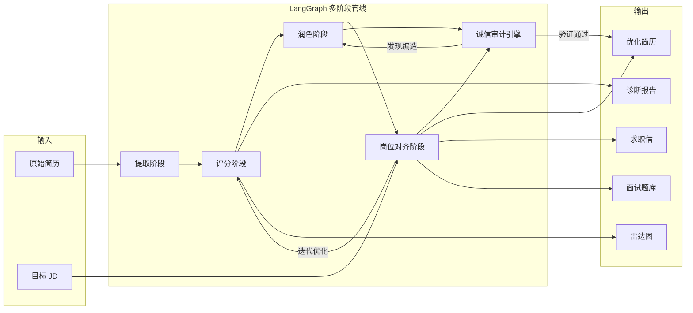

# 智能简历生成与优化系统

> 本仓库仅用于项目展示，不包含源代码。

## 项目概览

一个基于 LangChain / LangGraph 构建的多阶段 AI 简历优化系统。支持从原始简历出发，经过提取、评分、润色、岗位对齐等阶段，迭代生成高质量简历。内置零编造诚信审计引擎，确保 AI 输出的每一条数据都可追溯至原文。

**角色：** 独立开发

**周期：** 2026.02 - 至今

## 系统架构

## 核心技术亮点

### 1. LangGraph 多阶段 AI 管线

基于 LangGraph 构建有状态的多阶段处理流程，每个阶段可独立调试和替换：

| 阶段 | 功能 | 说明 |
|------|------|------|
| 提取 | 结构化解析 | 从非结构化简历文本中提取结构化数据 |
| 评分 | 多维度评估 | 11 维度评分 + 行业基准百分位排名 |
| 润色 | 内容优化 | 强化量化成果、优化措辞、补充行业关键词 |
| 岗位对齐 | JD 匹配 | 根据目标岗位调整简历重点和措辞 |

支持**迭代优化**：评分不满意可自动触发新一轮润色-对齐循环。

### 2. 零编造诚信审计引擎

AI 生成内容的最大风险是"幻觉"——凭空编造经历或数据。本系统设计了程序化审计机制：

- 逐条比对 AI 输出与原始简历文本
- 标记新增内容并分类：合理润色 / 推断补充 / 疑似编造
- 疑似编造项自动打回润色阶段重新生成
- 最终输出附带审计报告，所有数据可追溯

### 3. 11 维度评分体系

建立全面的简历质量评估模型：

- **内容维度：** 量化成果、技术深度、项目影响力、职业成长性
- **表达维度：** 措辞专业度、信息密度、逻辑连贯性
- **匹配维度：** 岗位契合度、关键词覆盖率、ATS 友好度
- **整体维度：** 综合竞争力评分

每个维度提供行业基准百分位排名，并生成诊断雷达图。

### 4. 全链路功能覆盖

除简历优化外，系统还提供：

- **JD 差距分析：** 对比简历与岗位要求，定位技能缺口
- **求职信生成：** 基于优化后的简历和目标 JD 自动生成
- **面试题库：** 根据简历内容预测面试官可能提问的技术问题
- **对话式交互：** Gradio Web 界面，支持对话式简历调优

### 5. 工程化实践

- **Pydantic 强类型约束：** 所有 LLM 输出通过 Pydantic 模型校验，确保结构一致性
- **Rich 终端输出：** 开发调试时提供美观的进度展示和结果预览
- **模块化设计：** 各阶段 Agent 独立封装，支持单独测试和替换

## 技术栈

**核心框架：** Python · LangChain · LangGraph

**数据校验：** Pydantic

**Web 界面：** Gradio

**开发工具：** Rich · Python 3.11+

## 设计理念

> "AI 可以帮你润色简历，但不能替你编造经历。"

本系统的核心设计原则是**诚信优先**——在充分利用大模型能力优化简历表达的同时，通过程序化手段杜绝内容编造，让求职者能放心使用 AI 辅助工具。
