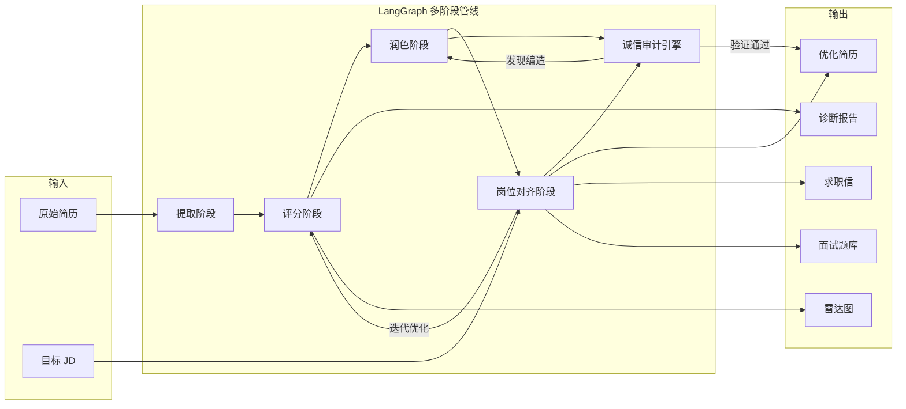
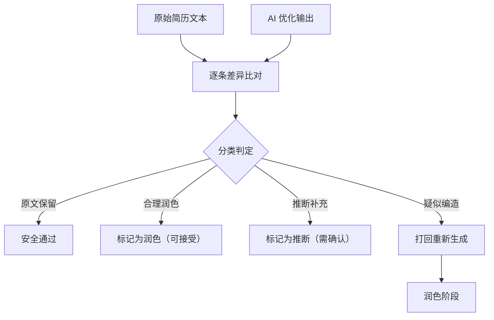

# 智能简历生成与优化系统

> 本仓库仅用于项目展示，不包含源代码。

## 项目概览

一个基于 LangChain / LangGraph 构建的多阶段 AI 简历优化系统。支持从原始简历出发，经过提取、评分、润色、岗位对齐等阶段，迭代生成高质量简历。内置零编造诚信审计引擎，确保 AI 输出的每一条数据都可追溯至原文。

**角色：** 独立开发

**周期：** 2026.02 - 至今

## 效果展示

<!-- 截图占位，后续替换为实际截图 -->

| Gradio 主界面 | 评分雷达图 | JD 差距分析 |
|:---:|:---:|:---:|
|  |  |  |

> 以上为占位图，实际截图待补充。

## 系统架构



## 核心技术亮点

### 1. LangGraph 多阶段 AI 管线

基于 LangGraph 构建有状态的多阶段处理流程，每个阶段可独立调试和替换：

| 阶段 | 功能 | 输入 | 输出 |
|------|------|------|------|
| 提取 | 结构化解析 | 原始简历文本 | Pydantic 结构化简历对象 |
| 评分 | 多维度评估 | 结构化简历 | 11 维度分数 + 诊断建议 |
| 润色 | 内容优化 | 结构化简历 + 诊断建议 | 优化后的简历 |
| 岗位对齐 | JD 匹配 | 优化简历 + 目标 JD | 岗位定制简历 |

支持**迭代优化**：评分不满意可自动触发新一轮润色-对齐循环，最多迭代 3 轮，防止死循环。

### 2. 零编造诚信审计引擎

AI 生成内容的最大风险是"幻觉"——凭空编造经历或数据。本系统设计了程序化审计机制：



**具体做法：**
- 将原始简历和 AI 输出按工作经历、项目经历等维度对齐
- 对每个条目做语义相似度比对（基于 embedding 余弦相似度）
- 相似度 > 0.85 判定为"合理润色"，0.6-0.85 判定为"推断补充"需用户确认，< 0.6 判定为"疑似编造"直接打回
- 新增的公司名、学校名、证书等硬事实类信息一律标红告警
- 最终输出附带审计报告，用户可以逐条确认或拒绝修改

### 3. 11 维度评分体系

建立全面的简历质量评估模型：

| 维度类别 | 具体指标 | 评估方法 |
|----------|----------|----------|
| **内容** | 量化成果、技术深度、项目影响力、职业成长性 | LLM 结构化评估 + 关键词密度分析 |
| **表达** | 措辞专业度、信息密度、逻辑连贯性 | LLM 评分 + STAR 格式检测 |
| **匹配** | 岗位契合度、关键词覆盖率、ATS 友好度 | JD 关键词提取 + 简历关键词比对 |
| **整体** | 综合竞争力评分 | 加权聚合 + 行业基准百分位 |

**行业基准：** 内置不同岗位（前端/后端/算法/全栈等）的评分基准线，基于对数百份公开简历样本的批量评估建立。用户的分数会标注在行业分布中的百分位排名。

### 4. 全链路功能覆盖

| 功能 | 说明 |
|------|------|
| **JD 差距分析** | 提取 JD 要求的技能/经验，逐条与简历匹配，输出"已覆盖/部分覆盖/缺失"三级评估 |
| **求职信生成** | 基于优化后的简历和目标 JD，生成针对性的求职信，突出匹配度最高的经历 |
| **面试题库** | 根据简历内容预测面试官可能提问的技术问题，附参考回答思路 |
| **对话式交互** | Gradio Web 界面，支持"帮我优化项目经历第 2 条"这样的自然语言指令 |

## 技术决策与取舍

### 为什么用 LangGraph 而不是简单的 LangChain chain？

简单的 `chain` 是线性管道：A → B → C → 输出。但简历优化场景需要：

- **条件分支：** 评分达标直接输出，不达标回到润色阶段
- **循环迭代：** 润色 → 评分 → 不满意 → 再润色，最多 3 轮
- **状态管理：** 每个阶段需要读写共享状态（原始简历、当前版本、历史分数）
- **审计旁路：** 诚信审计和主管线并行，可能触发打回

LangChain 的 `chain` 和 `SequentialChain` 无法优雅处理循环和条件跳转。LangGraph 的有向图模型天然支持这些场景：

```python
# 伪代码示意
graph = StateGraph(ResumeState)
graph.add_node("extract", extract_agent)
graph.add_node("score", score_agent)
graph.add_node("polish", polish_agent)
graph.add_node("align", align_agent)
graph.add_node("audit", audit_agent)

graph.add_edge("extract", "score")
graph.add_conditional_edges("score", should_continue,
    {"polish": "polish", "output": END})  # 达标就结束
graph.add_edge("polish", "align")
graph.add_edge("align", "audit")
graph.add_conditional_edges("audit", check_integrity,
    {"pass": END, "reject": "polish"})  # 审计不通过就打回
```

### LLM 输出不稳定怎么处理？

这是 LLM 应用开发中最常见也最棘手的问题：

1. **Pydantic 强类型约束：** 所有 LLM 输出必须通过 Pydantic 模型校验。使用 LangChain 的 `with_structured_output()` 强制 LLM 返回指定 JSON schema，解析失败自动重试（最多 3 次）
2. **评分一致性：** 同一份简历多次评分结果可能波动。解决方案：temperature 设为 0，每个维度给出明确的评分标准（rubric），并在 prompt 中附带 few-shot 示例
3. **润色过度：** LLM 有时会把"参与"改成"主导"，夸大贡献。通过诚信审计引擎兜底，同时在 prompt 中明确约束："只优化表达方式，不改变事实程度"
4. **长简历截断：** 简历内容较长时可能超出上下文窗口。按模块（工作经历、项目经历等）分段处理，最终合并输出

### Token 成本控制

作为独立项目，LLM API 调用成本需要控制：

- 提取和评分阶段使用较小的模型（如 GPT-4o-mini），润色和对齐阶段使用更强的模型
- 中间结果缓存：相同输入不重复调用
- 分段处理减少单次调用的 token 数量
- 迭代轮数上限为 3 轮，防止陷入循环消耗 token

## 工程化实践

- **Pydantic 强类型约束：** 所有阶段的输入输出都有明确的类型定义，LLM 输出不符合 schema 自动重试
- **Rich 终端输出：** 开发调试时用 Rich 美化进度条、表格、diff 对比展示
- **模块化设计：** 各阶段 Agent 独立封装，可单独测试、替换底层模型
- **配置化 Prompt：** Prompt 模板外置为配置文件，方便 A/B 测试不同 prompt 策略

## 技术栈

**核心框架：** Python · LangChain · LangGraph

**数据校验：** Pydantic

**Web 界面：** Gradio

**开发工具：** Rich · Python 3.11+

## 设计理念

> "AI 可以帮你润色简历，但不能替你编造经历。"

本系统的核心设计原则是**诚信优先**——在充分利用大模型能力优化简历表达的同时，通过程序化手段杜绝内容编造，让求职者能放心使用 AI 辅助工具。
